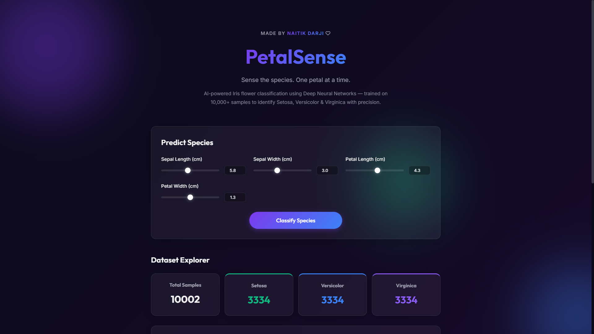
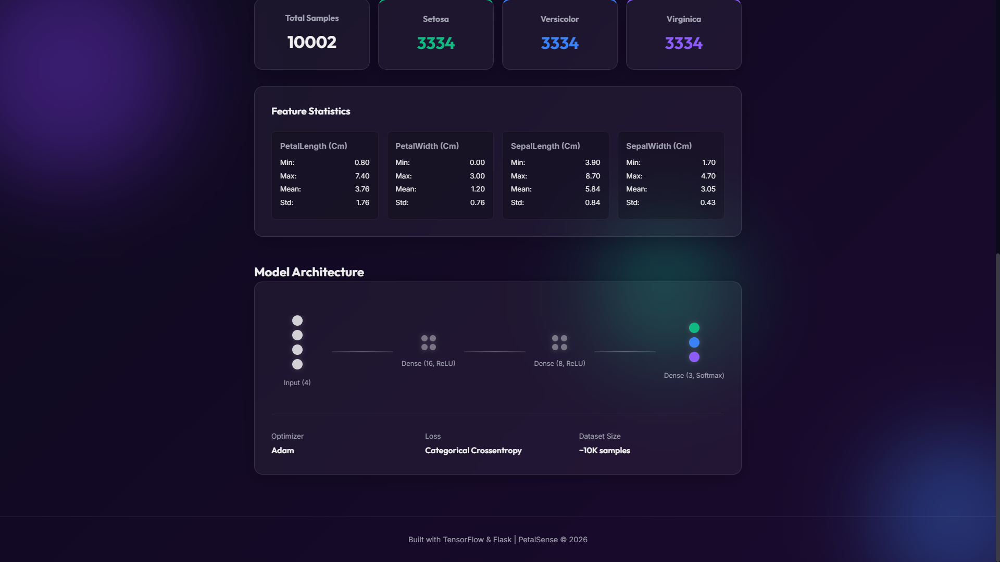
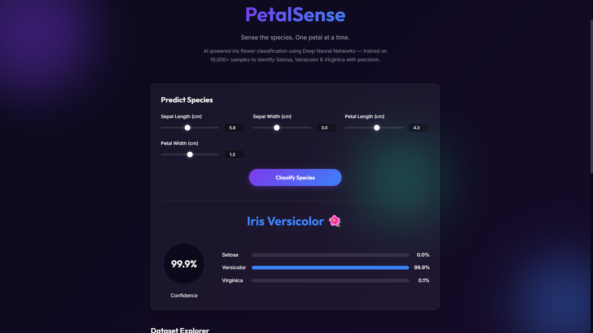

# 🌸 PetalSense

> **Sense the species. One petal at a time.**

<p align="center">
  
</p>
<p align="center">
  
  
</p>

**PetalSense** is an AI-powered Iris flower classification web application. Built with a Deep Neural Network (TensorFlow/Keras) and trained on an expanded dataset of 10,000+ samples, it identifies Iris species (Setosa, Versicolor, & Virginica) with high precision based on sepal and petal measurements.

Made by **Naitik Darji** ❤️

---

## ✨ Features
- **Deep Neural Network**: 3-layer dense network (16 → 8 → 3) with Softmax output.
- **Premium UI**: Stunning dark glassmorphism design with animated orbs and smooth transitions.
- **Interactive Predictions**: Real-time slider inputs for sepal and petal measurements.
- **Confidence Metrics**: Visual circular confidence meters and probability bars for all three species.
- **Dataset Insights**: Interactive dataset statistics directly on the dashboard.
- **Synthetic Data Pipeline**: Includes a script to expand the classic 150-sample Iris dataset to 10,000+ robust samples using multivariate normal distributions.

## 🛠️ Tech Stack
- **Frontend**: HTML5, Vanilla CSS (Glassmorphism), Vanilla JavaScript, FontAwesome
- **Backend**: Python, Flask, REST API
- **Machine Learning**: TensorFlow / Keras, Scikit-learn, Pandas, NumPy

---

## 🚀 Installation & Usage

### 1. Clone the repository
```bash
git clone https://github.com/naitikk31/Petal-Sense.git
cd Petal-Sense
```

### 2. Install Dependencies
Make sure you have Python 3.8+ installed.
```bash
pip install -r requirements.txt
```

### 3. (Optional) Generate the 10K Dataset
The repository already includes the 10K dataset (`Iris.csv`). If you want to regenerate it from scratch:
```bash
python generate_dataset.py
```

### 4. Run the Application
```bash
python app.py
```

### 5. Access the Web App
Open your browser and navigate to: **http://localhost:5000**

---

## 📂 Project Structure
```
Petal-Sense/
├── app.py                  # Flask backend & REST API
├── generate_dataset.py     # Script to generate 10K synthetic dataset
├── requirements.txt        # Python dependencies
├── Iris.csv                # The 10,000+ sample dataset
├── iris_model.h5           # Pre-trained Keras Neural Network model
├── project.ipynb           # Original Jupyter Notebook (EDA & Model Training)
├── screenshots/            # UI screenshots for README
├── templates/
│   └── index.html          # Main Single-Page Application (HTML)
└── static/
    ├── css/style.css       # Dark Glassmorphism CSS styles
    └── js/app.js           # Frontend Logic & Animations
```

---
*Created as a comprehensive Machine Learning & Full-Stack Development portfolio project.*
